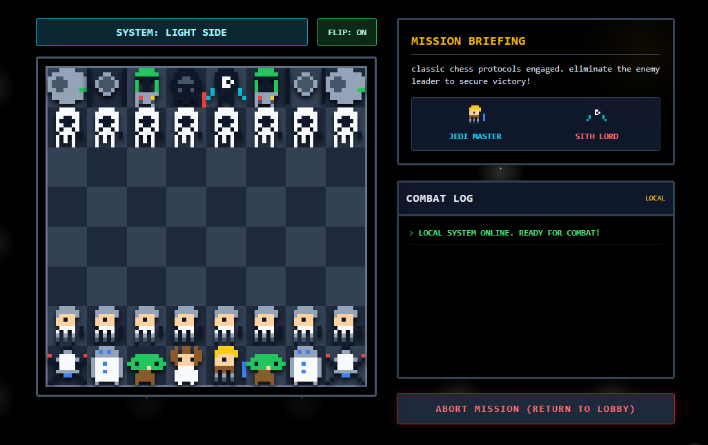

# Galactic Chess: 8-Bit Wars 🌌

A fully functional, Star Wars-themed 2D Chess game built with **React**, **Vite**, **Tailwind CSS**, and **Firebase**. Experience the classic strategy game with a retro 8-bit aesthetic, immersive animations, retro sound effects, and online multiplayer — all in your browser.

### 🌐 [▶ Play Now — Live Demo](https://star-wars-chess.vercel.app/)



## ✨ Features

### 🎮 Game Modes
- **Local Play (1 Screen)** — Play against a friend on the same device, turn by turn.
- **Online Multiplayer** — Create or join a room with a unique code and play against anyone in real-time via Firebase.

### ♟️ Star Wars Themed Pieces
- **Rebel Alliance (Light Side)**: Luke (King), Leia (Queen), Yoda (Bishop), R2-D2 (Knight), X-Wing (Rook), Rebel Troopers (Pawn).
- **Galactic Empire (Dark Side)**: Palpatine (King), Vader (Queen), Boba Fett (Bishop), TIE Fighter (Knight), Death Star (Rook), Stormtroopers (Pawn).

### 🎨 Retro 8-Bit Art
- Custom SVG pixel art sprites for all 12 unique chess pieces.
- Crisp rendering with `shapeRendering="crispEdges"` for an authentic retro feel.

### 🔊 Audio System
- 8-bit sound effects powered by the **Web Audio API** (no external audio files needed).
- Unique sounds for **move**, **capture**, and **error** actions.

### 🖥️ Immersive UI
- **Lobby Menu** — Choose between Local or Online play; create or join rooms.
- **Combat Log** — Real-time battle updates with flavor text (e.g., "CRITICAL HIT!", "The Galaxy is saved!").
- **Phase Animations** — Dramatic full-screen banners for Rebel / Empire turn transitions.
- **Board Auto-Flip** — Toggle automatic board rotation per turn for a natural playing perspective.
- **Dynamic Styling** — Glowing effects, floating animations, starfield background, and a sci-fi cockpit interface.

### ⚙️ Game Logic
- Fully implemented chess movement rules for all piece types.
- Valid move highlighting with cyan indicators.
- Capture mechanics with red ring highlights.
- Pawn promotion (auto-promotes to Queen/Vader).
- Win condition detection (King capture).

## 🚀 Getting Started

### Prerequisites

- [Node.js](https://nodejs.org/) (version 18 or higher recommended)
- npm or yarn

### Installation

1.  **Clone the repository**
    ```bash
    git clone https://github.com/painfulbykisses/star-wars-chess.git
    ```

2.  **Navigate to the project directory**
    ```bash
    cd star-wars-chess
    ```

3.  **Install dependencies**
    ```bash
    npm install
    ```

### Running the Game

Start the development server:
```bash
npm run dev
```
Open your browser and navigate to `http://localhost:5173` (or the URL shown in your terminal).

### Online Multiplayer Setup

> **Note:** Online multiplayer requires a Firebase project. If Firebase is not configured, the game will still work in **Local Play** mode.

To enable online mode, provide your Firebase config via the `__firebase_config` global variable before the app loads.

## 🛠️ Built With

- **[React](https://reactjs.org/)** — UI Library
- **[Vite](https://vitejs.dev/)** — Build tool
- **[Tailwind CSS](https://tailwindcss.com/)** — Utility-first CSS framework (v4 via @tailwindcss/vite)
- **[Firebase](https://firebase.google.com/)** — Backend for online multiplayer (Auth + Firestore)
- **Web Audio API** — Retro 8-bit sound effects

## 🔧 Troubleshooting

If you encounter styling issues (e.g., blocks instead of pixel art):
1.  **Restart the server**: Stop the terminal (`Ctrl+C`) and run `npm run dev` again.
2.  **Clean Cache**: Delete `node_modules/.vite` folder and restart.
3.  **Check Config**: Ensure `postcss.config.js` and `tailwind.config.js` are **NOT** present in the root directory.

## 📜 License

This project is open source and available under the [MIT License](LICENSE).

---
*May the Force be with you.* ⚔️
